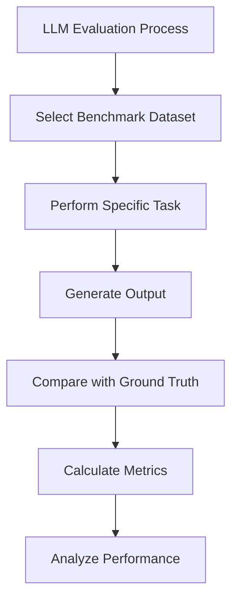

# Comprehensive Notes on Large Language Model (LLM) Evaluation

## 1. Introduction to LLM Evaluation

### Why Evaluate LLMs?
Large Language Models (LLMs) have become integral to various applications, but their responses are not always 100% accurate. Evaluation helps us:
- Verify the correctness of LLM outputs
- Ensure reliability in real-world scenarios
- Compare different models effectively
- Identify areas for improvement

### The Basic LLM Interaction Flow
```
User → [Prompt/Question] → LLM → [Response] → User
```

**Example: Simple Question-Answering**
- **User asks:** "What is the capital of New Zealand? Just give the city name."
- **LLM responds:** "Wellington"
- **Evaluation:** Easy to verify since we know the ground truth

**Example: Complex Tasks (Where Evaluation Becomes Critical)**
1. **Document Summarization:** LLM reads a document and generates a summary
2. **Code Generation:** LLM writes code (e.g., C# Playwright test) that may contain errors
3. **Creative Writing:** LLM generates content that requires qualitative assessment

## 2. Standardized Evaluation Approach

### Benchmark Datasets
LLMs are evaluated using standardized datasets that assess performance across diverse tasks:

| Task Category | Examples | Purpose |
|--------------|----------|---------|
| **Text Summarization** | Document condensation | Test information distillation |
| **Open-Book QA** | Fact-based questions | Assess knowledge retrieval |
| **Code Generation** | Programming tasks | Evaluate coding capability |
| **Language Understanding** | Sentiment analysis, NLI | Test comprehension skills |

These benchmarks enable:
- Fair comparison between different models
- Objective performance measurement
- Identification of model strengths/weaknesses
- Progress tracking over time



## 3. Evaluation Metrics Categories

### 3.1 Traditional Metrics
Focus on **word order and structure**, comparing generated text against reference (ground truth).

| Metric | Full Name | Use Case | How It Works |
|--------|-----------|----------|--------------|
| **Exact Match (EM)** | Exact Match | QA, Classification | Checks if prediction exactly matches reference |
| **BLEU** | Bilingual Evaluation Understudy | Translation | Measures n-gram precision against reference |
| **ROUGE** | Recall-Oriented Understudy for Gisting Evaluation | Summarization | Compares overlap of n-grams, word sequences |
| **F1-Score** | F1 Score | Various classification tasks | Harmonic mean of precision and recall |

**Mathematical Foundation:**

For **BLEU Score**:
```
BLEU = BP × exp(∑_{n=1}^N w_n log p_n)
```
Where:
- `BP` = Brevity Penalty (penalizes short translations)
- `p_n` = Precision for n-grams
- `w_n` = Weights for different n-grams (typically uniform)

For **F1-Score**:
```
Precision = TP / (TP + FP)
Recall = TP / (TP + FN)
F1 = 2 × (Precision × Recall) / (Precision + Recall)
```

### 3.2 Non-Traditional Metrics
Leverage **semantic understanding** and model capabilities, can work with or without reference.

| Metric Type | Description | Examples |
|-------------|-------------|----------|
| **Embedding Similarity** | Compares semantic meaning using vector embeddings | Cosine similarity, Euclidean distance |
| **Perplexity** | Measures how well model predicts sample | Lower perplexity = better prediction |
| **LLM-based Scoring** | Uses LLM to evaluate LLM output | GPT-4 as judge, Self-evaluation |

**Key Difference:**
Traditional metrics require **exact reference text**, while non-traditional metrics can evaluate based on **semantic meaning** or **model confidence**.

## 4. Comprehensive Evaluation Metrics List

### 4.1 Content Quality Metrics

1. **Answer Relevancy**
   - Measures how relevant the answer is to the question
   - Critical for QA systems and chatbots

2. **Faithfulness**
   - Evaluates if generated content stays true to source material
   - Prevents fabrication or distortion of information

3. **Contextual Relevancy**
   - Assesses if response is appropriate for given context
   - Important for conversational AI

4. **Completeness**
   - Checks if answer fully addresses the query
   - Identifies partial or incomplete responses

### 4.2 Safety and Reliability Metrics

5. **Bias Detection**
   - Identifies biased language or perspectives
   - Ensures fair and equitable responses

6. **Hallucination Detection**
   - Flags when model generates factually incorrect information
   - Critical for factual accuracy

### 4.3 Context-Aware Metrics

7. **Context Precision**
   - Measures relevance of retrieved context for RAG systems
   - Formula: `Relevant Retrieved Context / Total Retrieved Context`

8. **Context Recall**
   - Measures how much relevant context was retrieved
   - Formula: `Relevant Retrieved Context / Total Relevant Context`

### 4.4 Function-Calling Metrics

9. **Tool Selection Accuracy**
   - For agents that use tools/APIs
   - Measures correct tool choice for given task

10. **Function Argument Accuracy**
    - Evaluates correct parameter passing to functions
    - Ensures proper API/tool usage

### 4.5 Conversational Metrics

11. **Conversational Relevancy**
    - Maintains relevance throughout multi-turn conversations
    - Prevents topic drift

12. **Conversation Completeness**
    - Ensures conversational goals are fully achieved
    - Tracks task completion in dialogues

## 5. Practical Implementation Framework

### Evaluation Workflow
```
1. Define Test Cases
   ↓
2. Generate LLM Responses
   ↓
3. Collect Ground Truth (if available)
   ↓
4. Apply Evaluation Metrics
   ↓
5. Aggregate Scores
   ↓
6. Analyze Results
```

### Metric Selection Guidelines

| Use Case | Recommended Metrics |
|----------|-------------------|
| **Summarization** | ROUGE, Faithfulness, Completeness |
| **QA Systems** | Answer Relevancy, Exact Match, F1-Score |
| **Code Generation** | Code correctness tests, Tool Selection Accuracy |
| **Conversational AI** | Contextual Relevancy, Conversational metrics |
| **Content Creation** | Hallucination detection, Bias detection |

### Tools and Libraries Mentioned
- **RAGAS**: Framework for RAG pipeline evaluation
- **DeepEval**: Provides various metric implementations
- **Hugging Face Evaluate**: Library for model evaluation
- **Olama**: For local LLM deployment and testing

## 6. Mathematical Foundation for Key Metrics

### ROUGE Score Calculation
**ROUGE-N** (N-gram overlap):
```
ROUGE-N = ∑_{gram_n∈Reference} Count_match(gram_n) / ∑_{gram_n∈Reference} Count(gram_n)
```

**ROUGE-L** (Longest Common Subsequence):
```
R_lcs = LCS(X,Y) / m
P_lcs = LCS(X,Y) / n
ROUGE-L = (1 + β²) × (R_lcs × P_lcs) / (R_lcs + β² × P_lcs)
```
Where:
- `LCS(X,Y)` = Length of LCS between X and Y
- `m`, `n` = Lengths of reference and candidate
- `β` = Weight parameter (usually β = 1)

### Perplexity Calculation
```
Perplexity = exp(-1/N ∑_{i=1}^N log p(w_i|w_{<i}))
```
Where:
- `N` = Number of tokens
- `p(w_i|w_{<i})` = Probability of token given previous tokens
- Lower perplexity indicates better language modeling

## 7. Challenges and Considerations

### Evaluation Challenges
1. **Subjectivity**: Some tasks lack objective ground truth
2. **Cost**: Comprehensive evaluation can be resource-intensive
3. **Bias in Evaluation**: Evaluation metrics themselves may have biases
4. **Evolving Standards**: New metrics emerge as LLM capabilities expand

### Best Practices
1. **Use Multiple Metrics**: No single metric captures all aspects
2. **Human-in-the-Loop**: Combine automated and human evaluation
3. **Domain-Specific Adaptation**: Customize metrics for specific use cases
4. **Continuous Evaluation**: Regularly test as models and data evolve

## 8. Conclusion

LLM evaluation is a multifaceted discipline requiring:
- **Technical understanding** of different metric types
- **Practical knowledge** of implementation tools
- **Critical thinking** about what constitutes "good" output
- **Continuous adaptation** to evolving model capabilities

The field continues to evolve with new metrics and approaches emerging regularly. A robust evaluation strategy combines traditional automated metrics with human judgment and domain-specific considerations to ensure LLM applications perform reliably in real-world scenarios.

---

*These notes provide a comprehensive foundation for understanding LLM evaluation, covering theoretical concepts, practical implementations, and mathematical foundations. The content is structured to support both learning and practical application in testing LLM-based systems.*
