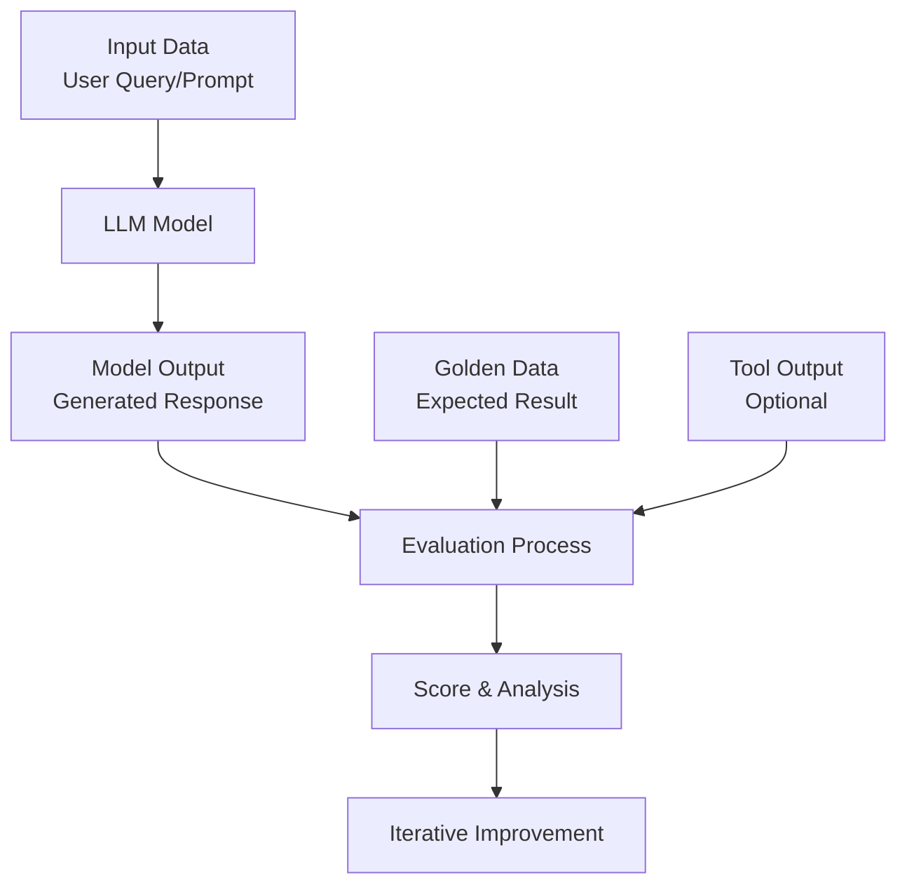
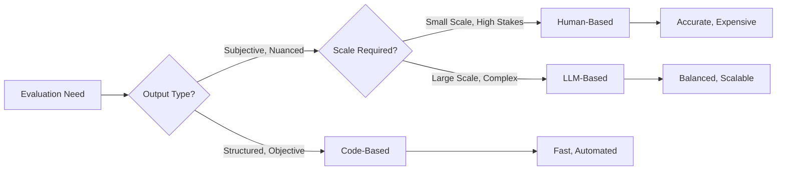

# Large Language Model (LLM) Evaluation: Fundamentals & Methods

## 1. Introduction to LLM Evaluation

In the rapidly evolving field of artificial intelligence, **Large Language Models (LLMs)** have become powerful tools for businesses across various industries. Unlocking their full potential requires not only implementation but also careful **evaluation** and **optimization**. This process, often called **"evals"** (evaluations), is crucial for ensuring LLM applications perform reliably and effectively in production.

### The Core Challenge
A major truth in LLM development, as highlighted by Claude's team, is:
> *"The inability for teams to measure the performance of their models is the biggest blocker of production use cases for LLMs and makes prompting an art instead of a science."*

Despite evaluations taking significant time upfront, they save developer time in the long run and result in better products reaching market sooner.

## 2. Why Evaluate LLMs? The Critical Benefits

| Benefit | Description |
|---------|-------------|
| **Iterative Prompt Improvement** | Continuous refinement of prompts based on performance metrics |
| **Quality Assurance (QA) Before/After Deployment** | Ensuring reliability pre-deployment and monitoring performance post-deployment |
| **Model Comparison for Objective Selection** | Data-driven decisions when choosing between different models or versions |
| **Cost Saving** | Identifying inefficiencies and optimizing resource usage |

## 3. The LLM Evaluation Framework

Every LLM evaluation involves these key components:

### 3.1 Components of Evaluation


**Detailed Breakdown:**

1. **Input Data**: The user query or prompt given to the LLM
   - Example: "What is the capital of New Zealand?"

2. **Golden Data (Expected Results)**: The ideal or expected output
   - Example: "Wellington"
   - This serves as the benchmark for evaluation

3. **Model Output**: The actual response generated by the LLM
   - Example: "The capital of New Zealand is Wellington."

4. **Tool Output** (for AI Agents & RAG systems):
   - **Tool Selection**: Which external tool was used (search, calculator, etc.)
   - **Tool Results**: Data retrieved from external sources

5. **Score**: Quantitative or qualitative assessment of performance
   - Can be numeric (0-100) or categorical (Good/Fair/Poor)

## 4. Types of LLM Evaluation

### 4.1 Human-Based Evaluation
**When to use**: Tasks requiring human judgment, subjective assessment, or domain expertise

**Characteristics:**
- **Best for**: Complex, nuanced tasks where automated metrics fall short
- **Evaluators**: Typically domain experts or trained assessors
- **Process**: Humans review outputs, check quality, and assign scores
- **Examples**: Medical diagnosis evaluation by doctors, creative writing assessment by editors

**Advantages:**
- Captures subtlety and context
- Handles subjective criteria effectively
- Domain expertise ensures accurate assessment

**Limitations:**
- Time-consuming and expensive
- Not scalable for large datasets
- Subject to human bias and inconsistency

### 4.2 Code-Based Evaluation
**When to use**: Tasks with clear, objective, and unambiguous criteria

**Characteristics:**
- **Best for**: Structured outputs, data extraction, classification tasks
- **Method**: Programmatic verification against expected values
- **Examples**: 
  - Extracting phone numbers from text (regex validation)
  - Checking if code compiles without errors
  - Verifying JSON structure compliance

**Advantages:**
- Fast and automated
- Consistent and reproducible
- Scales easily to large datasets
- Precise for well-defined tasks

**Limitations:**
- Cannot handle nuanced or creative responses
- Limited to structured, predictable outputs
- Misses semantic correctness in favor of syntactic

### 4.3 LLM-Based Evaluation (LLM as Judge)
**When to use**: Balanced approach between human judgment and automation

**Characteristics:**
- **Best for**: Complex assessments requiring language understanding
- **Method**: Uses another LLM (or same one) to evaluate outputs
- **Examples**: Assessing answer relevance, coherence, factual accuracy

**Advantages:**
- Handles subjective criteria better than code-based methods
- Faster and more scalable than human evaluation
- Can assess a wide range of criteria using natural language
- Consistent across large evaluation sets

**Common Validation Metrics Using LLM-as-Judge:**

| Category | Specific Metrics |
|----------|-----------------|
| **General Metrics** | Answer Relevance, Factual Accuracy, Coherence |
| **RAG Metrics** | Contextual Precision, Contextual Recall, Contextual Relevancy, Faithfulness |
| **Agentic Metrics** | Task Completion, Tool Selection Accuracy, Task Correctness |
| **Conversational Metrics** | Conversational Relevance, Role Adherence, Knowledge Retention |
| **Quality Metrics** | Bias Detection, Toxicity Scoring, Hallucination Detection |
| **Specialized** | Summarization Quality, Prompt Alignment, Sentiment Analysis |

## 5. The Evaluation Process Flow

### 5.1 Step-by-Step Evaluation Workflow

1. **Test Case Creation**
   - Define input prompts
   - Establish golden/expected outputs
   - Set evaluation criteria

2. **Prompt Engineering & Refinement**
   - Iteratively improve prompts based on evaluation results
   - Balance clarity, specificity, and flexibility

3. **Evaluation Execution**
   - Run LLM with test cases
   - Capture outputs systematically
   - Apply chosen evaluation method (human/code/LLM)

4. **Analysis & Scoring**
   - Compare outputs against golden data
   - Calculate performance metrics
   - Identify patterns and failure modes

5. **Iteration & Deployment**
   - Refine prompts and models based on findings
   - Deploy to production with confidence
   - Monitor continuously for drift

### 5.2 Evolution of Testing Approaches
Traditional software testing (unit tests, integration tests) differs significantly from LLM evaluation:

| Aspect | Traditional Testing | LLM Evaluation |
|--------|-------------------|----------------|
| **Predictability** | Deterministic outputs | Probabilistic, varied outputs |
| **Validation** | Exact matching | Semantic similarity, relevance |
| **Scope** | Code functionality | Language understanding, reasoning |
| **Tools** | Testing frameworks (JUnit, pytest) | Evaluation frameworks (DeepEval, RAGAS) |

## 6. Practical Implementation Considerations

### 6.1 When to Use Each Evaluation Type



### 6.2 Common Pitfalls to Avoid

1. **Over-reliance on automated metrics** that miss semantic quality
2. **Insufficient golden data** leading to biased evaluations
3. **Ignoring edge cases** and failure modes
4. **Not accounting for LLM variability** (temperature, sampling parameters)
5. **Missing the human-in-the-loop** for critical applications

### 6.3 Tools for LLM Evaluation

| Tool | Primary Use | Evaluation Type |
|------|-------------|-----------------|
| **DeepEval** | Comprehensive evaluation framework | LLM-based, Code-based |
| **RAGAS** | RAG system evaluation | LLM-based, Specific metrics |
| **Hugging Face Evaluate** | General model evaluation | Code-based, Benchmarking |
| **LangSmith** | LLM application monitoring | Mixed (tracing, evaluation) |
| **Weights & Biases** | Experiment tracking + evaluation | Mixed |

## 7. Real-World Application Example

### 7.1 Healthcare Diagnosis Assistant Evaluation

**Scenario**: An LLM helps doctors with preliminary diagnoses based on symptoms.

**Evaluation Approach:**
- **Human-Based**: Doctors review diagnosis suggestions for accuracy
- **Code-Based**: Check for required disclaimers and formatting
- **LLM-Based**: Assess coherence and relevance of explanations

**Test Case Example:**
```
Input: "Patient presents with fever, cough, and shortness of breath for 3 days."
Golden Data: "Consider: Pneumonia, COVID-19, Influenza. Recommended tests: Chest X-ray, CBC, PCR."
Model Output: [LLM-generated response]
Evaluation: 
  - Code check: Contains required disclaimer? ✓
  - LLM-as-judge: Relevance score: 92/100
  - Human doctor: "Medically sound suggestions, appropriate tests"
```

## 8. Conclusion: Making Prompting a Science

LLM evaluation transforms prompting from an **art** into a **science** by:
1. **Providing measurable metrics** for prompt effectiveness
2. **Enabling systematic improvement** through iteration
3. **Building confidence** in production deployments
4. **Reducing costs** through optimized resource usage
5. **Ensuring reliability** across diverse use cases

The key insight is that while evaluations require upfront investment, they pay dividends through:
- Reduced debugging and maintenance time
- Higher quality outputs
- More predictable system behavior
- Better user satisfaction

As LLM applications become increasingly critical to business operations, establishing robust evaluation practices is not optional—it's essential for building trustworthy, effective AI systems that deliver real value while managing risks appropriately.

> **Remember**: You cannot improve what you cannot measure. LLM evaluation provides the measurement framework that enables continuous improvement and responsible deployment of AI applications.
