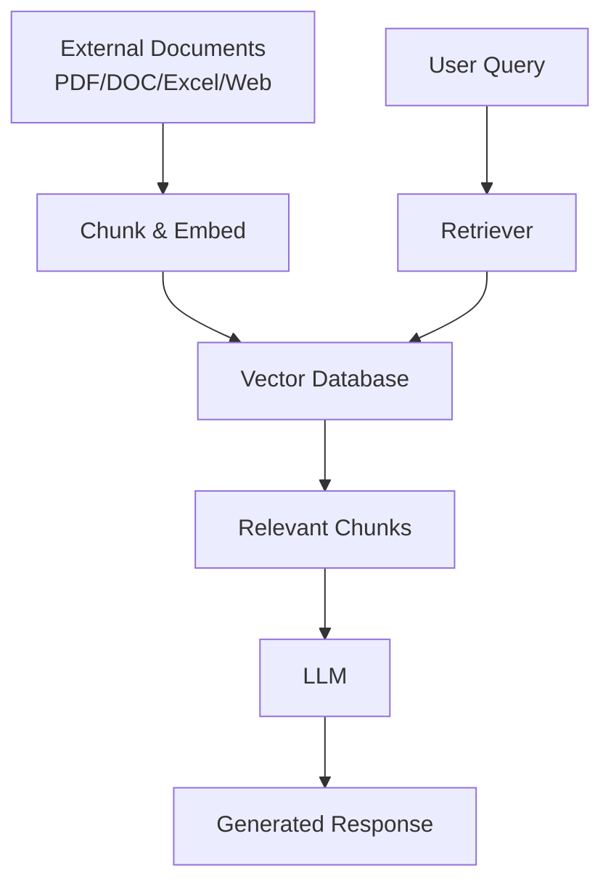

```markdown
# Understanding Types of AI Applications

## 1. What is an AI Application?

An **AI application** is a software program that uses Artificial Intelligence (AI) techniques to perform tasks that typically require human intelligence. These tasks include:

- Learning
- Reasoning
- Problem-solving
- Perception
- Language understanding
- Decision-making

AI applications are now being integrated into various industries, making processes smarter and more efficient. While the types are vast, we will focus on the most common and impactful ones in the context of Large Language Models (LLMs).

---

## 2. Common Types of AI Applications

### 2.1 Chatbots

**Chatbots** are conversational AI programs designed to simulate human-like interactions. They have gained massive popularity since the launch of ChatGPT.

**Key Characteristics:**
- Can answer questions, provide explanations, and generate content.
- Use natural language processing (NLP) to understand and respond to user inputs.
- Can be general-purpose (like ChatGPT) or specialized for specific domains.

**Example: ChatGPT**
- You can ask it anything, from simple factual questions to complex coding problems.
- It can tailor responses to different audiences (e.g., “explain like a kindergarten teacher”).
- It can generate code, write essays, summarize texts, and more.

**How it works:**
1. User inputs a query.
2. The LLM processes the query using its trained knowledge.
3. The model generates a response based on patterns learned during training.

> **Note:** Chatbots like ChatGPT do not always need real-time data; they rely on pre-trained knowledge unless augmented with external tools.

---

### 2.2 AI Agents

**AI Agents** are systems that enable an LLM to interact with the external world by using tools or accessing real-time data.

**Key Functions:**
1. **Web Searching:** Fetch current information from the internet.
2. **Code Assistance:** Help write, debug, and improve code.
3. **Context Enhancement:** Provide additional, relevant context to improve responses.

**Example in ChatGPT:**
- When you enable the **web search** feature, the AI agent performs a real-time search to answer questions about recent events.
- Without this agent, the model might give outdated or incorrect answers for time-sensitive queries.

**How it works:**
```
User Query → LLM → AI Agent (uses tool e.g., search) → Fetches external data → LLM formulates response → User
```

> **Note:** AI agents bridge the gap between static LLM knowledge and dynamic real-world information.

---

### 2.3 RAG (Retrieval Augmented Generation)

**RAG** is a technique that retrieves data from external sources (PDFs, documents, databases, web scraped data) and provides it to an LLM to generate accurate, context-aware responses.

**Why RAG is important:**
- LLMs have knowledge cutoffs and may not know recent or proprietary information.
- RAG supplies relevant, up-to-date, or specific data to the model, improving answer quality.

**Example:**
1. Upload a PDF (e.g., a research paper).
2. Ask a question about the PDF’s content.
3. The RAG system retrieves relevant passages from the PDF and passes them to the LLM.
4. The LLM generates an answer based on the provided context.

**How RAG works (simplified):**



**Steps:**
1. **Document Processing:** External documents are split into chunks and converted into vector embeddings.
2. **Storage:** Embeddings are stored in a vector database.
3. **Retrieval:** For a query, the system finds the most semantically similar chunks.
4. **Generation:** The LLM uses the retrieved chunks as context to generate a response.

> **Note:** RAG is widely used in enterprises to build internal Q&A systems using company documents.

---

### 2.4 Other AI Application Types

| Type | Description |
|------|-------------|
| **AI in Software Automation Testing** | Uses AI to generate, execute, and maintain test cases automatically. |
| **AI for Web Scraping & Data Extraction** | Employs AI to extract and structure data from websites efficiently. |
| **AI for Healthcare** | Assists in diagnosis, drug discovery, patient monitoring, and medical imaging analysis. |
| **AI for Education** | Personalizes learning, automates grading, and provides tutoring. |
| **AI for Robotics** | Enables robots to perceive, learn, and make decisions autonomously. |
| **AI for Defense** | Used in surveillance, threat detection, and strategic planning. |
| **AI for Farming** | Optimizes crop yield, monitors soil health, and automates harvesting. |

These applications leverage AI to solve industry-specific problems, making processes faster, safer, and more efficient.

---

## 3. Why Understanding These Types Matters

Before testing or evaluating an AI application, it’s crucial to know **what type it is** and **how it works**. Each type has unique:

- **Input/Output mechanisms**
- **Dependencies** (e.g., external data, tools)
- **Failure modes**
- **Evaluation metrics**

For example:
- A **chatbot** may be evaluated on fluency and relevance.
- An **AI agent** must be tested on tool usage accuracy and data freshness.
- A **RAG system** requires validation of retrieval accuracy and context relevance.

---

## 4. Summary

| Application Type | Core Function | Key Feature |
|------------------|---------------|-------------|
| **Chatbots** | Conversational interaction | General-purpose Q&A, content generation |
| **AI Agents** | Tool usage & real-time access | Web search, code assistance, context enhancement |
| **RAG** | Context-augmented generation | Document retrieval, up-to-date responses |
| **Others** | Industry-specific automation | Tailored to domain needs (healthcare, testing, etc.) |

Understanding these foundational types helps in designing, building, and critically **testing** robust AI applications. As AI evolves, new hybrid types will emerge, but the core principles remain grounded in how the model interacts with data, tools, and users.

> *“The power of LLMs is not just in what they know, but in how they can be extended to know more and do more.”*
```
